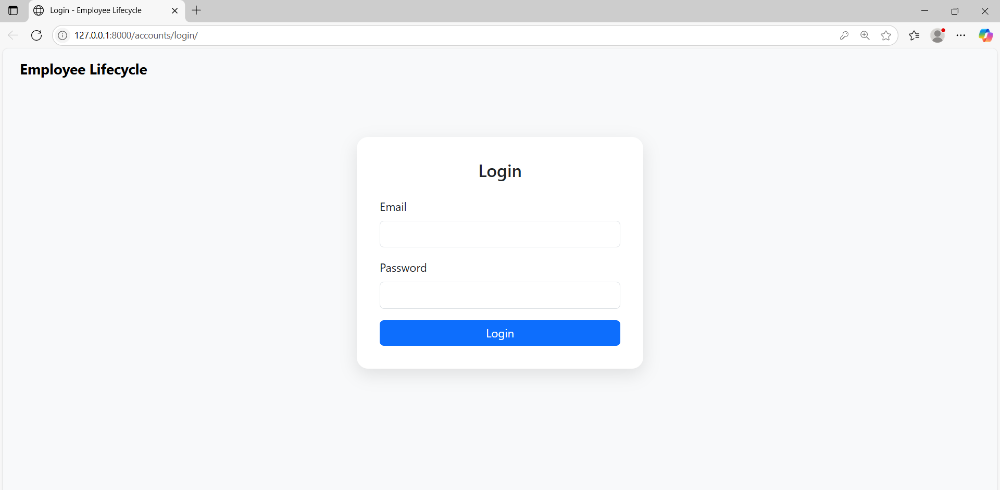
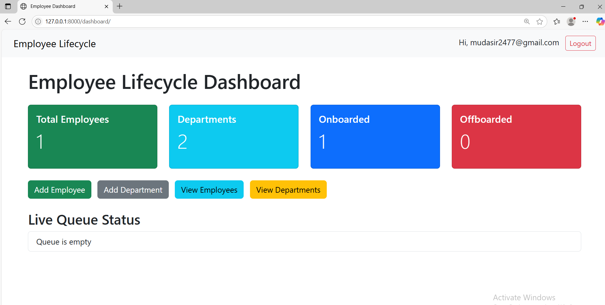

-----------### Employee Lifecycle Management System ####--------------------

A full-stack Django web application to manage the complete employee lifecycle in an organization — from onboarding to offboarding. This system provides department and employee management, email automation, and queue-based processing.

---

# Project Objective

Design a scalable, modular application that enables:

- Seamless employee onboarding/offboarding.
- Department-wise organization.
- Automated email communication via Gmail SMTP.
- Queue-based processing using fundamental DSA concepts.
- An intuitive dashboard for HR/admins.

---

## Tech Stack

| Layer     | Technology                |
|-----------|---------------------------|
| Frontend  | Bootstrap 5 [HTML/CSS]    |
| Backend   | Django (Python)           |
| Database  | MySQL                     |
| Email     | Gmail SMTP (App Password) |
| DSA       | Queue (in-memory)         |

---

## Features

### 1. Employee Management

- Fields: `id`, `name`, `email`, `date_of_joining`, `date_of_exit`, `department_id`, `status`.
- Unique email constraint.
- SQL JOIN used to fetch department name with employees.

### 2. Department Management

- Fields: `id`, `name`, `location`.
- Unique department name constraint.

### 3. Onboarding/Offboarding Queue
- In-memory queue for task management.
- Sequential processing with simulated delay.
- **Onboarding**:
  - Welcome email.
  - Status updated to `onboarded`.
- **Offboarding**:
  - Farewell email.
  - Status updated to `offboarded`.

### 4. Dashboard
- View total:
  - Employees
  - Departments
  - Onboarded
  - Offboarded
- Filter employees by department and status.
- View queue status (`pending`, `processing`).
- Bootstrap-based responsive UI.

### 5. Email Integration
- Gmail SMTP used for sending:
  - Welcome emails.
  - Farewell emails.
- Gmail App Password required.

---

## 📁 Project Structure

```bash
employee_lifecycle_project/
├── accounts/              # Authentication app 
├── management/            # main app: departments, employees, queue
│   ├── templates/
│   ├── static/
│   ├── views.py
│   ├── models.py
│   ├── forms.py
│   └── urls.py
├── employee_lifecycle_project/
│   ├── settings.py
│   ├── urls.py
│   └── wsgi.py
└── manage.py


# Setup Instructions

1. Clone Repository

git clone https://github.com/mudasir2419/Employee_Life_Cycle_Project.git
cd employee-lifecycle-management


2. Create Virtual Environment

python -m venv venv
source venv/bin/activate  # On Windows: venv\Scripts\activate


3. Install Dependencies

pip install -r requirements.txt

4. Configure Database (MySQL)
Update settings.py:


#MYSQL 

DATABASES = {
    'default': {
        'ENGINE': 'django.db.backends.mysql',
        'NAME': 'employee_db',
        'USER': 'your_mysql_user',
        'PASSWORD': 'your_password',
        'HOST': 'localhost',
        'PORT': '3306',
    }
}

5. Configure Gmail SMTP
Add in settings.py:

EMAIL_BACKEND = 'django.core.mail.backends.smtp.EmailBackend'
EMAIL_HOST = 'smtp.gmail.com'
EMAIL_PORT = 587
EMAIL_USE_TLS = True
EMAIL_HOST_USER = 'your_email@gmail.com'
EMAIL_HOST_PASSWORD = 'your_app_password'

6. Apply Migrations

python manage.py makemigrations
python manage.py migrate


7. Create Superuser 

python manage.py createsuperuser
8. Run Server

python manage.py runserver


🔒 Security Notes

use App Passwords for Gmail SMTP

Handle IntegrityError exceptions for unique email/department constraints.


# DSA Usage

A simple in-memory Queue is used to simulate sequential onboarding/offboarding processes.

Each queue item processes:

Email delivery.

Status update.

Delayed simulation using time.sleep() 

 Screenshots
Add screenshots of dashboard, forms, queue status (optional for README visual appeal).






# Future Enhancements

Admin role separation (staff/HR vs employee).

Employee login and self-service portal.

Unit and integration tests.


# Contact
For queries or contributions:

Developer: Mudasir
Email: mudasir8309@gmail.com
GitHub: https://github.com/mudasir2419 

